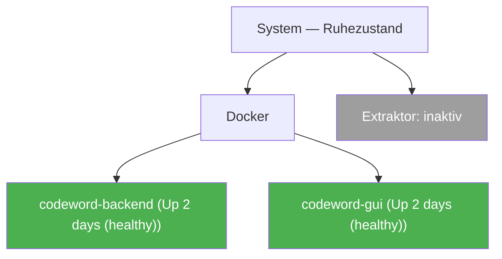

# System Visualization

**Zeitstempel:** 2026-03-12 00:19:07
**Zustand:** Ruhezustand

```mermaid
graph TD
    SYS["System — Ruhezustand"]
    SYS --> DOCKER["Docker"]
    DOCKER --> DC0["codeword-backend (Up 2 days (healthy))"]
    style DC0 fill:#4CAF50,color:#fff
    DOCKER --> DC1["codeword-gui (Up 2 days (healthy))"]
    style DC1 fill:#4CAF50,color:#fff
    SYS --> PROCS_IDLE["Extraktor: inaktiv"]
    style PROCS_IDLE fill:#9E9E9E,color:#fff
```
